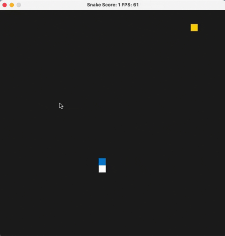
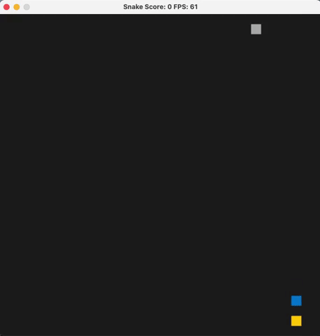

# CPPND: Capstone Snake Game Example

This is a starter repo for the Capstone project in the [Udacity C++ Nanodegree Program](https://www.udacity.com/course/c-plus-plus-nanodegree--nd213). The code for this repo was inspired by [this](https://codereview.stackexchange.com/questions/212296/snake-game-in-c-with-sdl) excellent StackOverflow post and set of responses.

The Capstone Project gives you a chance to integrate what you've learned throughout this program. This project will become an important part of your portfolio to share with current and future colleagues and employers.

In this project, you can build your own C++ application or extend this Snake game, following the principles you have learned throughout this Nanodegree Program. This project will demonstrate that you can independently create applications using a wide range of C++ features.

# My work for the Capstone project

1. Fix a petit logic bug of the example, when i was playing the example, i found the little snack could turn opposite if the player 
   turn left left or right right very quickly, which could make the snack too flexible.
   

2. Add a barrier element, if the snack strike the barrier, the game will over. Here i implemented the knowledge of Object-Oriented Programming.
I initial the location of barrier by two constraints: not a part of the snack and not the same location of food. Besides, i pass barrier by reference.

3. 

## Rubric Points
README - Here
Compiling and Testing - The program runs well, you could see the live gif.

Loop, functions, I/O
* The project demonstrates an understanding of C++ functions and control structures. - game.cpp line 24-51, running the game by loop
* The project reads data from a file and process the data, or the program writes data to a file. - main.cpp line 17-20, output the score and size at the end of game.
* The project accepts user input and processes the input. - controller.cpp line 12-37, change the direction of snake by input. Or accelerate it by space (to be finish)

Object Oriented Programming
* The project uses Object Oriented Programming techniques. - snake.h line 7-38, game.h line 7-33
* Classes use appropriate access specifiers for class members. - snake.h keep the public interface and the private element well
* Class constructors utilize member initialization lists. - game.h line 28, initial the score with 0
* Classes abstract implementation details from their interfaces. - game.h line 15-16, we implement the two interface in game.cpp line 108-109
* Classes encapsulate behavior. - snake.h line 36-37, we encapsulate the grid_width and grid_height, those variable should not be changed by users
* Classes follow an appropriate inheritance hierarchy.
* Overloaded functions allow the same function to operate on different parameters. 
* Derived class functions override virtual base class functions.
* Templates generalize functions in the project.

Memory Management
* The project makes use of references in function declarations. - renderer.cpp line 41 pass barrier by reference
* The project uses destructors appropriately. 
* The project uses scope / Resource Acquisition Is Initialization (RAII) where appropriate.
* The project follows the Rule of 5.
* The project uses move semantics to move data, instead of copying it, where possible.
* The project uses smart pointers instead of raw pointers.

Concurrency
* The project uses multithreading.
* A promise and future is used in the project.
* A mutex or lock is used in the project.
* A condition variable is used in the project.

## Dependencies for Running Locally
* cmake >= 3.7
  * All OSes: [click here for installation instructions](https://cmake.org/install/)
* make >= 4.1 (Linux, Mac), 3.81 (Windows)
  * Linux: make is installed by default on most Linux distros
  * Mac: [install Xcode command line tools to get make](https://developer.apple.com/xcode/features/)
  * Windows: [Click here for installation instructions](http://gnuwin32.sourceforge.net/packages/make.htm)
* SDL2 >= 2.0
  * All installation instructions can be found [here](https://wiki.libsdl.org/Installation)
  >Note that for Linux, an `apt` or `apt-get` installation is preferred to building from source. 
* gcc/g++ >= 5.4
  * Linux: gcc / g++ is installed by default on most Linux distros
  * Mac: same deal as make - [install Xcode command line tools](https://developer.apple.com/xcode/features/)
  * Windows: recommend using [MinGW](http://www.mingw.org/)

## Basic Build Instructions

1. Clone this repo.
2. Make a build directory in the top level directory: `mkdir build && cd build`
3. Compile: `cmake .. && make`
4. Run it: `./SnakeGame`.

## CC Attribution-ShareAlike 4.0 International

Shield: [![CC BY-SA 4.0][cc-by-sa-shield]][cc-by-sa]

This work is licensed under a
[Creative Commons Attribution-ShareAlike 4.0 International License][cc-by-sa].

[![CC BY-SA 4.0][cc-by-sa-image]][cc-by-sa]

[cc-by-sa]: http://creativecommons.org/licenses/by-sa/4.0/
[cc-by-sa-image]: https://licensebuttons.net/l/by-sa/4.0/88x31.png
[cc-by-sa-shield]: https://img.shields.io/badge/License-CC%20BY--SA%204.0-lightgrey.svg
